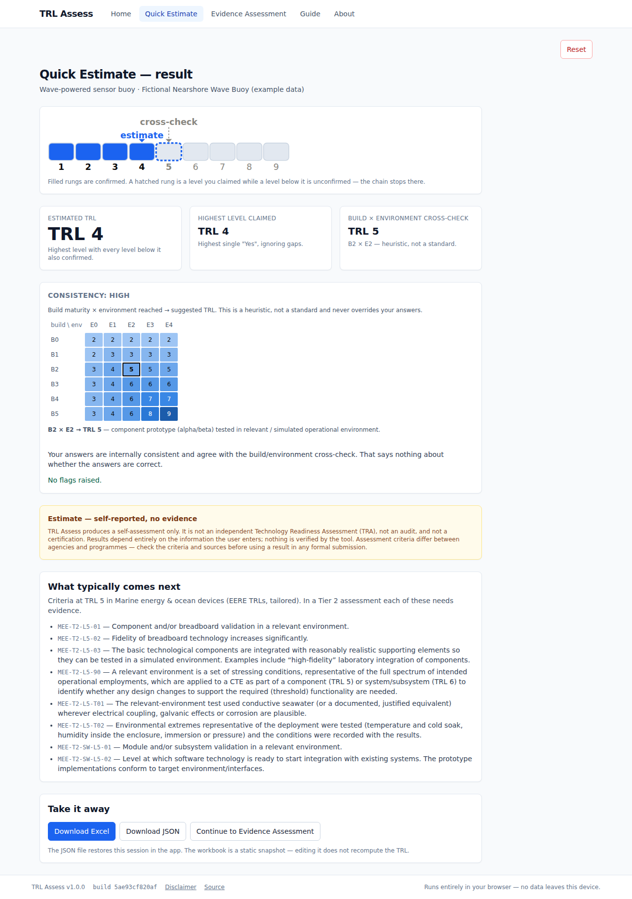
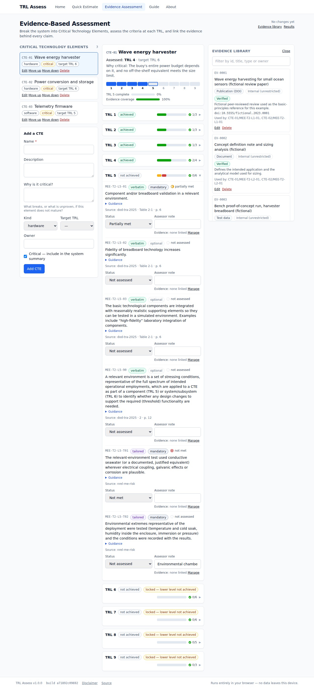
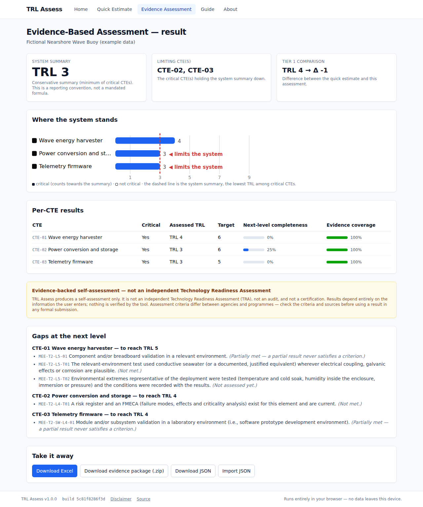
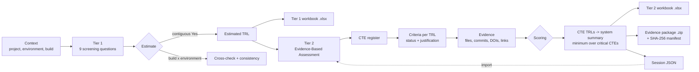

# TRL Assess

**A general-purpose Technology Readiness Level (TRL) and Adoption Readiness Level (ARL) self-assessment — in your browser, with no backend.**

[](https://github.com/Denny-Hwang/TRL-assess/actions/workflows/ci.yml)
[](https://github.com/Denny-Hwang/TRL-assess/actions/workflows/deploy.yml)


## What it is

TRL Assess helps a project team work out how mature a technology actually is, and prove it. You can
run a **quick estimate** in about five minutes with no documents, or build an **evidence-based
assessment** in which every claim is tied to a report, a test record, a pinned commit or a DOI. Both
export to Excel; the evidence-based one can be packaged as a `.zip` with the evidence files and a
SHA-256 manifest. A separate **Adoption Readiness Level (ARL)** module rates the 17 adoption-risk
dimensions of the DOE Adoption Readiness Assessment — what stands between a working technology and
its use. The interface is available in English (default), Korean, Chinese, Japanese, Spanish,
German, Hindi and Arabic — pick a language from the selector in the header. Everything runs
client-side:
the app makes no network requests at runtime, and nothing you enter leaves your browser except in
files you download.

**What it is not.** It is not an independent Technology Readiness Assessment (TRA). It is not an
audit and not a certification. It cannot verify anything you tell it. A real TRA is run by a team
independent of the programme, under an agency's process, and it can reject your evidence.

## Live app and screenshots

**https://denny-hwang.github.io/TRL-assess/**

| Tier 1 result                                    | Tier 2 criteria                                      | Tier 2 result                                    |
| ------------------------------------------------ | ---------------------------------------------------- | ------------------------------------------------ |
|  |  |  |

## Why

TRL definitions are broadly shared across agencies; the **criteria** — what you must show to claim a
level — are not. NASA, DoD, DOE, GAO and ISO all publish different ones, so "TRL 6" means different
things in different rooms. Most self-assessments are a number in a slide with nothing behind it.

This tool does three things about that:

1. It names the framework and version behind every number, in the app and in every export.
2. It refuses to count a claim that has no evidence behind it.
3. It records where each criterion came from — document, section and page — and whether the wording
   is verbatim, adapted or tailored.

## Features

- **Tier 1 Quick Estimate** — nine screening questions, presented TRL 9 → 1, with keyboard shortcuts,
  a build × environment cross-check and a consistency rating.
- **Tier 2 Evidence-Based Assessment** — Critical Technology Elements, per-TRL criteria with
  mandatory/optional and origin badges, evidence linking, gap analysis and a conservative system
  summary.
- **Adoption readiness (ARL) side module** — the 17 dimensions of the DOE _Adoption Readiness
  Assessment_ (Version: April 2025) with the rubric text on every card, current and end-of-project
  ratings, and ARL Start and ARL End read from the source's own look-up table. Scored apart from
  TRL; never combined.
- **Excel export** — six sheets for Tier 1, nine for Tier 2, seven for ARL, with data
  validation, conditional formatting, working `HYPERLINK()` formulas and pre-formatted placeholder
  rows.
- **Evidence package** — a `.zip` containing the workbook, the session JSON, the evidence files and a
  `MANIFEST.sha256.txt` a reviewer can verify.
- **JSON save/restore** — a lossless round-trip of the whole assessment.
- **Eight interface languages** — English, 한국어, 中文, 日本語, Español, Deutsch, हिन्दी, العربية
  (right-to-left).
- **Offline-capable static site** — no backend, no accounts, no telemetry, no third-party requests.

## How it works



The scoring rules in one paragraph: a level counts only if every level below it counts; "Unsure"
never counts as "Yes"; a criterion is satisfied when it is _Met_ with at least one non-rejected
evidence item, or _N/A_ with a justification; a level is achieved when every applicable mandatory
criterion at that level is satisfied; a CTE's TRL is its highest achieved level; and the system
summary is the minimum across the CTEs marked critical. Full detail, with three worked examples, is
in **Guide › [Methodology](https://denny-hwang.github.io/TRL-assess/#/guide/methodology)**.

The ARL side module stands apart: each of the 17 adoption-risk dimensions is rated Low, Medium or
High (or N/A), now and at the end of the project; the Medium and High counts are read against the
source's look-up table to give ARL Start and ARL End; Unsure, unrated and unexplained N/A count as
High. See **Guide › [Adoption readiness](https://denny-hwang.github.io/TRL-assess/#/guide/arl)**.

## Frameworks & sources

| Framework                  | Scope                                     | Tier 1                                | Tier 2                                                   |
| -------------------------- | ----------------------------------------- | ------------------------------------- | -------------------------------------------------------- |
| `dod-tra-2025` _(default)_ | Generic hardware, software and process    | Adapted from the DoD hardware table   | Verbatim DoD hardware, software and environment criteria |
| `marine-energy-eere`       | Marine energy and ocean-observing devices | Adapted from DOE EERE TRL definitions | DoD criteria + 8 marine/ocean tailoring items            |

The ARL side module scores against `doe-otc-arl-2025` — the DOE Adoption Readiness Assessment's 17
dimensions, rating text and look-up table, transcribed verbatim.

| Source id                     | Document                                                              | Held                                             | Quotable                                  |
| ----------------------------- | --------------------------------------------------------------------- | ------------------------------------------------ | ----------------------------------------- |
| `eere-r540-112-02`            | DOE EERE R 540.112-02, _Technology Readiness Levels (TRLs)_           | Yes                                              | Yes (public domain)                       |
| `dod-tra-2025`                | DoD _Technology Readiness Assessment Guidebook_, Feb 2025             | Yes                                              | Yes (public domain)                       |
| `dod-mrl-matrix-2018`         | DoD _Manufacturing Readiness Level Matrix_ V2018                      | Yes                                              | Reference only                            |
| `doe-otc-arl-2025`            | DOE OTC _Adoption Readiness Assessment_, Version: April 2025          | Yes                                              | Yes (public domain)                       |
| `nrel-me-risk`                | NREL _Marine Energy Technology Development Risk Management Framework_ | No                                               | Basis of tailoring rationales only        |
| `nrel-tpl`, `goos-foo`        | NREL TPL; GOOS Framework for Ocean Observing                          | No                                               | Reference only                            |
| `iso-16290`                   | ISO 16290:2013                                                        | No                                               | **Clause references only — never quoted** |
| `doe-g413-3-4a`, `gao-20-48g` | DOE G 413.3-4A; GAO-20-48G                                            | **No — not obtainable in the build environment** | No content is attributed to them          |

**Provenance policy.** Every question and criterion carries an `origin`:

- `verbatim` — copied exactly; permitted only from public-domain, quotable U.S. Government documents,
  and only with a section or page reference.
- `adapted` — source wording restructured (for example, a definition turned into a question); a
  rationale is required.
- `tailored` — not in any source; a rationale is required.

`npm run validate:criteria` enforces all of this, including the ISO rule. Details and SHA-256 hashes
of the held documents are in [docs/sources/SOURCES.md](docs/sources/SOURCES.md).

## Data privacy & security

- **Client-side only.** No backend, no accounts, no analytics, no telemetry. The end-to-end tests
  fail the build if the app makes any cross-origin request.
- **Where your data lives:** the assessment in `localStorage` (`trl-assess:session:v1`), evidence
  file contents in IndexedDB (`trl-assess-evidence`). Nothing is synced between devices.
- **Clearing it:** "Clear all local data" in the app removes both; clearing site data in the browser
  does the same.
- **Controlled information:** do not enter classified, export-controlled or CUI material. Evidence
  marked **"Sensitive — reference only"** refuses to accept a file, so you can record a pointer —
  title, custodian, reference number — without placing the content in a tool on a public site. Those
  items are never bundled into an evidence package.
- A restrictive Content-Security-Policy meta tag limits the page to same-origin resources.

See [SECURITY.md](SECURITY.md).

## Excel output

**Tier 1 workbook** — `TRL_Tier1_<project>_<YYYYMMDD-HHmm>.xlsx`

| Sheet                        | Contents                                                                                  |
| ---------------------------- | ----------------------------------------------------------------------------------------- |
| `README`                     | Label, disclaimer, sheet guide, placeholder instructions, tool/framework/build provenance |
| `Summary`                    | Estimated TRL, highest level claimed, cross-check, consistency rating, flags              |
| `Context`                    | Every context field, with environment and build codes explained                           |
| `Responses`                  | One row per question: answer (validated), note, origin, source                            |
| `Next_Evidence_Placeholders` | Criteria for the next two levels + 10 blank planning rows                                 |
| `References`                 | Source documents with clickable URLs                                                      |

**Tier 2 workbook** — `TRL_Tier2_<project>_<YYYYMMDD-HHmm>.xlsx`

| Sheet                 | Contents                                                                                                        |
| --------------------- | --------------------------------------------------------------------------------------------------------------- |
| `README`              | As above, plus how to attach evidence in Excel                                                                  |
| `Summary`             | System summary, limiting CTE(s), Tier 1 delta, per-CTE table                                                    |
| `CTE_Register`        | Every CTE with kind, critical flag, owner, target and assessed TRL                                              |
| `Criteria_Assessment` | One row per CTE × criterion: status, justification, computed Satisfied, evidence ids, placeholder column, notes |
| `Evidence_Register`   | Every evidence item + **50** pre-formatted blank placeholder rows (`EV-P001`…)                                  |
| `Gap_Actions`         | Unmet mandatory criteria at each CTE's next level + 20 blank rows                                               |
| `Review_Signoff`      | Assessor and independent-reviewer blocks with a validated conclusion list                                       |
| `References`          | Every source cited by the framework                                                                             |
| `Metadata`            | Schema, app and framework versions, git SHA, timestamps, package type, counts                                   |

**ARL workbook** — `ARL_<project>_<YYYYMMDD-HHmm>.xlsx`

| Sheet             | Contents                                                                                                                      |
| ----------------- | ----------------------------------------------------------------------------------------------------------------------------- |
| `README`          | ARL label and disclaimer, how the ARL is calculated, provenance                                                               |
| `Summary`         | ARL Start, ARL End (target), tallies per core risk area, flags                                                                |
| `Scope`           | Technology scope, value chain scope, timeline, policy environment                                                             |
| `Risk_Assessment` | One row per dimension: current rating (validated), what it counted as and why, rationale, target, planned action, rubric text |
| `ARL_Lookup`      | The source look-up table with the Start and Target cells marked                                                               |
| `References`      | The rubric                                                                                                                    |
| `Metadata`        | Schema, app and rubric versions, the session's TRL framework, git SHA, timestamps                                             |

**How the placeholders work.** Blank rows already carry the validation lists and the `Open` formula
`=IF(G{r}<>"",HYPERLINK(G{r},"Open file"),IF(F{r}<>"",HYPERLINK(F{r},"Open link"),""))`. Fill in a URL
or a relative path and the link becomes clickable. Computed values are static: editing the workbook
does not recompute the TRL — change it in the app and export again.

## Evidence package

```
TRL_Tier2_<project>_<YYYYMMDD-HHmm>/
├── TRL_Tier2_<project>_<YYYYMMDD-HHmm>.xlsx   # "Local file" cells link into evidence/
├── session.json                                # the full assessment, re-importable
├── evidence/
│   ├── EV-0001_test-report.pdf
│   └── …
├── MANIFEST.sha256.txt                         # every packaged file except the manifest
└── README.txt                                  # how to verify and open
```

Verify the contents after unzipping:

```bash
# Linux / macOS
cd TRL_Tier2_<project>_<timestamp>
sha256sum -c MANIFEST.sha256.txt
```

```powershell
# Windows PowerShell
Get-Content MANIFEST.sha256.txt | ForEach-Object {
  $parts = $_ -split "\s+", 2
  $hash = (Get-FileHash -Algorithm SHA256 $parts[1].Trim()).Hash.ToLower()
  if ($hash -eq $parts[0]) { "OK   $($parts[1])" } else { "FAIL $($parts[1])" }
}
```

Unzip the whole folder before opening the workbook, and keep the workbook next to `evidence/` —
that is what makes the relative links work. Files over 50 MB are rejected, and a package over
250 MB is refused with a list of the largest files.

## Quick start (users)

1. Open **https://denny-hwang.github.io/TRL-assess/** and choose **Quick Estimate**.
2. Fill in the context — project, technology, assessor, and the two dropdowns for environment and
   build maturity.
3. Answer the nine questions (`Y` / `N` / `U` on the keyboard). Note anything that is not obvious.
4. Read the result, then **Continue to Evidence Assessment** to break the system into CTEs and attach
   the proof.
5. Export the workbook, or the evidence package if you want the files travelling with it.

Nothing is uploaded, so export before clearing your browser data.

## Local development

Prerequisites: **Node.js ≥ 20** and npm.

```bash
git clone https://github.com/Denny-Hwang/TRL-assess.git
cd TRL-assess
npm ci

npm run dev                 # dev server on http://localhost:5173/TRL-assess/
npm run test                # unit + component tests with coverage thresholds
npm run test:e2e            # Playwright end-to-end tests (build first)
npm run validate:criteria   # framework schema + provenance checks
npm run check:links         # documentation link check
npm run verify              # everything the CI gate runs
npm run build && npm run preview
npm run screenshots         # regenerate docs/img/*.png
```

`npm run test:e2e` needs a build (`npm run build`) and a Chromium. On a machine where Playwright's
own download is unavailable, point it at an existing browser with
`PLAYWRIGHT_CHROMIUM_PATH=/path/to/chrome npm run test:e2e`.

## Project structure

```
src/
├── config/app.config.ts        # every tunable value — the single source of truth
├── data/
│   ├── frameworks/<id>/        # framework.json, tier1.json, tier2.json, tier1-matrix.json
│   ├── frameworks/arl/         # ARL rubric (doe-otc-arl-2025.json)
│   ├── examples/               # the fictional example session
│   └── sources.ts              # machine-readable mirror of docs/sources/SOURCES.md
├── i18n/                       # interface text: en/ (English) + one catalog per language
├── domain/                     # pure TypeScript: schemas, scoring, session, hashing (no React)
├── export/                     # excel/ (shared, tier1, tier2, arl), zip/ (package), download helpers
├── storage/                    # localStorage session store, IndexedDB blob store
├── state/                      # zustand store with autosave
├── features/                   # home, tier1, tier2, arl, guide, about
├── components/                 # shared UI
└── content/guide/              # the in-app Guide (English *.md, translations in <lang>/)
scripts/                        # validate-criteria.ts, check-docs-links.ts
tests/{unit,component,e2e}/     # Vitest unit/component tests, Playwright end-to-end tests
docs/                           # SOURCES, screenshots
```

## Configuration

Everything tunable lives in `src/config/app.config.ts`:

| Key                               | Default                      | Effect                                                        |
| --------------------------------- | ---------------------------- | ------------------------------------------------------------- |
| `APP_NAME`                        | `TRL Assess`                 | Title, footer, export metadata                                |
| `GITHUB_OWNER` / `REPO_NAME`      | `Denny-Hwang` / `TRL-assess` | Source and issue links, Pages URL                             |
| `PAGES_BASE_PATH`                 | `/TRL-assess/`               | Vite `base`; must equal `/<REPO_NAME>/`                       |
| `DEFAULT_FRAMEWORK`               | `dod-tra-2025`               | Framework selected for a new session                          |
| `MAX_EVIDENCE_FILE_MB`            | `50`                         | Largest single evidence file accepted                         |
| `MAX_PACKAGE_TOTAL_MB`            | `250`                        | Pre-flight limit for the evidence package                     |
| `BLANK_EVIDENCE_PLACEHOLDER_ROWS` | `50`                         | Blank rows appended to `Evidence_Register`                    |
| `BLANK_GAP_ACTION_ROWS`           | `20`                         | Blank rows appended to `Gap_Actions`                          |
| `SCHEMA_VERSION`                  | `2`                          | Session schema; bump with a migration hook (v2 adds `arl`)    |
| `DEFAULT_ARL_FRAMEWORK`           | `doe-otc-arl-2025`           | ARL rubric used for a new ARL assessment                      |
| `AUTOSAVE_DEBOUNCE_MS`            | `600`                        | Debounce for text edits (structural changes save immediately) |
| `TIER1_LABEL` / `TIER2_LABEL`     | —                            | Honest-labelling strings used in the UI and every export      |
| `ARL_LABEL` / `ARL_TARGET_LABEL`  | —                            | The ARL module's own labels, on its result page and workbook  |

`VITE_BASE_PATH` overrides the base path at build time; `VITE_GIT_SHA` overrides the build SHA.

## Editing or adding criteria

Frameworks are data, not code.

1. Edit `src/data/frameworks/<id>/tier1.json` or `tier2.json` — or add a new folder and register it
   in `src/data/frameworks/index.ts`.
2. Give every item a `source` (`sourceId`, `section`, `page`) and an `origin`. `tailored` and
   `adapted` items need a `rationale`.
3. An extending framework may reference a base criterion with `{ id, refId, mandatory?, … }` instead
   of repeating its text; text, source and origin always come from the base, so provenance cannot be
   rewritten downstream.
4. Run `npm run validate:criteria`, bump the framework `version`, and add a CHANGELOG entry.

To report a problem with a criterion rather than fix it, open a **Criteria correction** issue. See
[CONTRIBUTING.md](CONTRIBUTING.md).

## Testing & quality gates

`npm run verify` runs lint → typecheck → tests → criteria validation → link check → build, and is
what CI enforces on every pull request.

- **Coverage:** `src/domain` must stay at ≥ 95 % lines, functions and statements and ≥ 85 % branches
  Every scoring rule has a named test.
- **Bundle budget:** the entry chunk must stay under 300 kB gzip and must not contain ExcelJS or
  JSZip.
- **Accessibility:** axe checks run against every route in Playwright; zero serious or critical
  issues are allowed.
- **Network guard:** the end-to-end tests fail if the app issues any cross-origin request.
- Tests are never skipped or weakened to make CI pass.

## Deployment

GitHub Pages, via `.github/workflows/deploy.yml`, on every push to `main` and on demand
(`workflow_dispatch`). The workflow builds with `VITE_GIT_SHA` set to the commit, uploads the Pages
artifact and deploys it with the official Pages actions.

**First-time setup, required once:** repository **Settings → Pages → Build and deployment →
Source: GitHub Actions**, then re-run the "Deploy to GitHub Pages" workflow. Until Pages is enabled
the deploy job fails at `actions/configure-pages` with "Get Pages site failed … Not Found"; the
workflow's own token is not permitted to create the site. The base path
must match the repository name — if you fork under another name, change `REPO_NAME` in
`src/config/app.config.ts` (and the default in `vite.config.ts`).

## Versioning & changelog

[Semantic Versioning](https://semver.org/spec/v2.0.0.html), with the history in
[CHANGELOG.md](CHANGELOG.md) in [Keep a Changelog](https://keepachangelog.com/en/1.1.0/) format. The
running version and git SHA are shown in the app footer and written into every export, so any
workbook can be traced back to the build that produced it.

## Limitations & disclaimer

TRL Assess produces a **self-assessment only**. It is not an independent Technology Readiness
Assessment, not an audit, and not a certification. Results depend entirely on the information the
user enters; nothing is verified by the tool. Assessment criteria differ between agencies and
programmes — check the criteria and their sources before using a result in any formal submission.

Specific limitations to be aware of:

- The build × environment matrix in Tier 1 is a **heuristic aid created for this tool**, not a
  standard, and never overrides your answers.
- The system summary is the **minimum across critical CTEs** — a conservative reporting convention,
  not a mandated formula.
- The generic `dod-tra-2025` framework marks **no criterion mandatory**, because its source does not
  classify them; every level in that framework is flagged for assessor confirmation.
- DOE G 413.3-4A and GAO-20-48G were not obtainable in the build environment, so neither is
  implemented and no content is attributed to them.
- The TRL 9 question in the marine framework comes from the DoD guidebook, because the EERE source
  defines TRL 1–8 only.
- Exported workbooks are static snapshots and cannot be re-imported; session JSON can.
- The ARL module applies DOE's rubric to **your** ratings; DOE does not review or endorse the result.
  Counting Unsure, Not assessed and N/A-without-rationale as High risk is this tool's conservative
  convention, not a rule of the source.

## Citation

See [CITATION.cff](CITATION.cff), or cite as: _TRL Assess (version 0.1.0). https://github.com/Denny-Hwang/TRL-assess_

## License

[MIT](LICENSE). The transcribed criteria come from U.S. Government public-domain documents; ISO
material is cited by clause only and never reproduced.

## Acknowledgments

Criteria are transcribed from work published by the U.S. Department of Defense (OUSD(R&E)) and the
U.S. Department of Energy (Office of Energy Efficiency and Renewable Energy; Office of Technology
Commercialization). The optional marine tailoring is informed by NREL's marine-energy risk framework
and by the GOOS Framework for Ocean Observing.

## Contact

Issues and questions: https://github.com/Denny-Hwang/TRL-assess/issues
