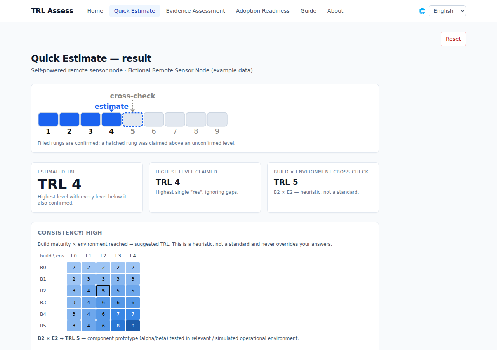
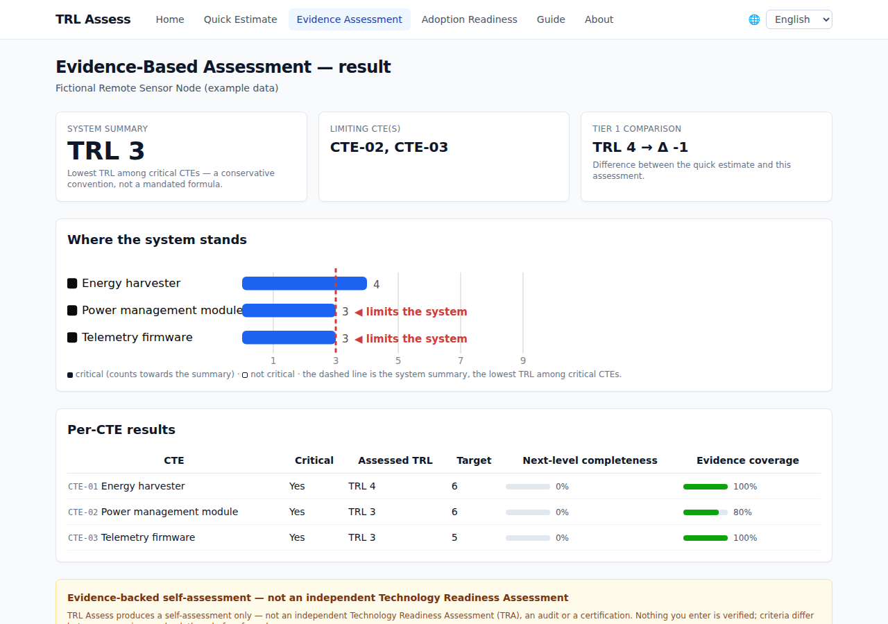
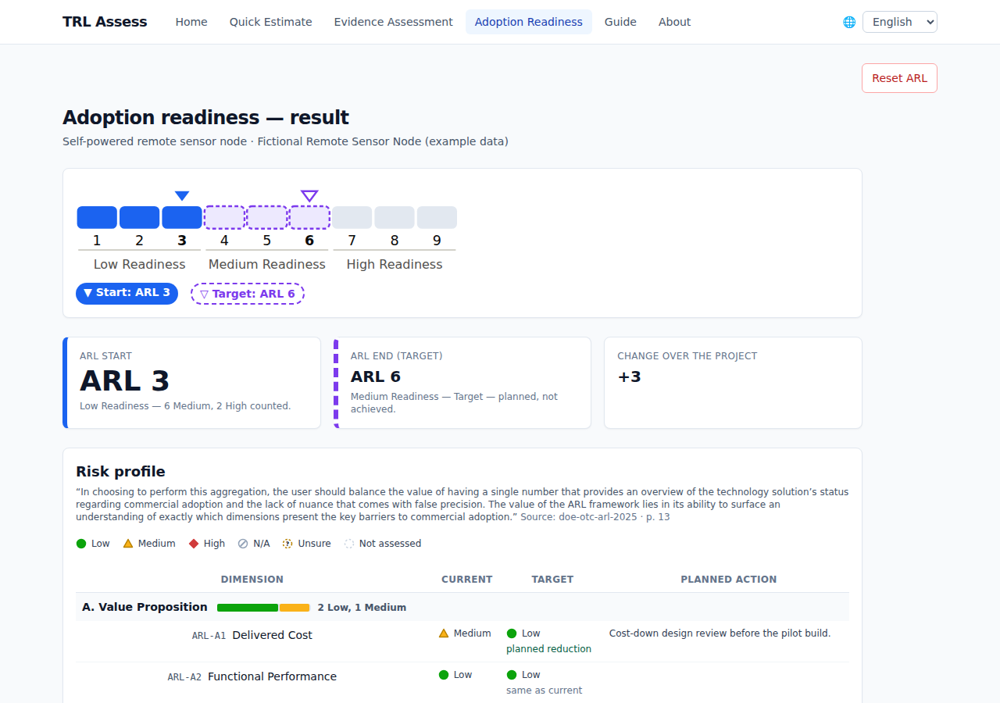
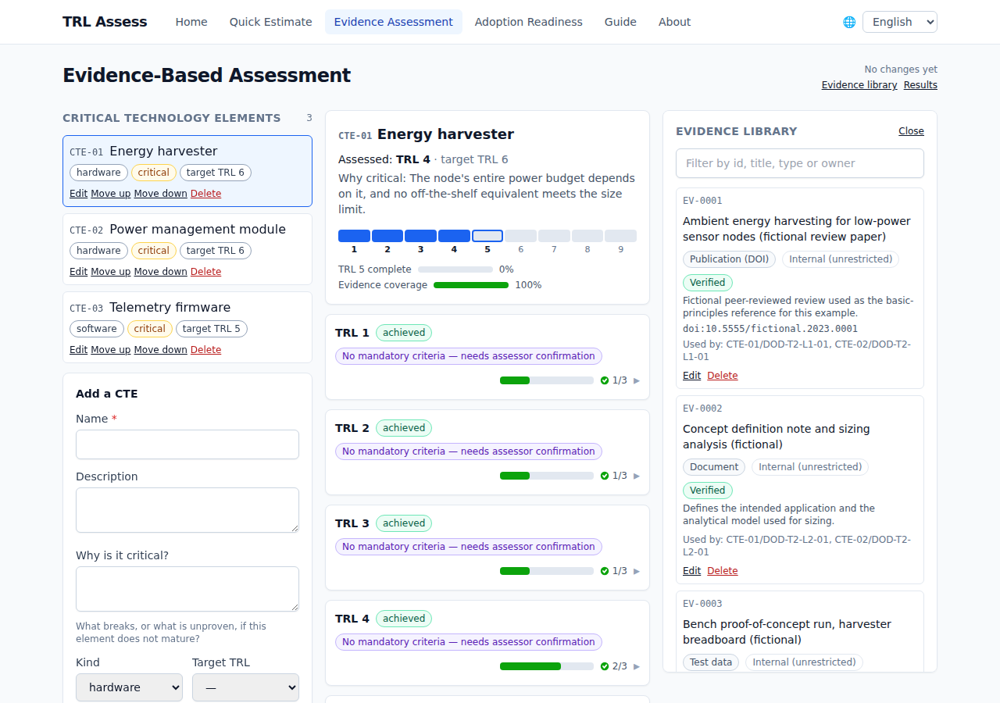
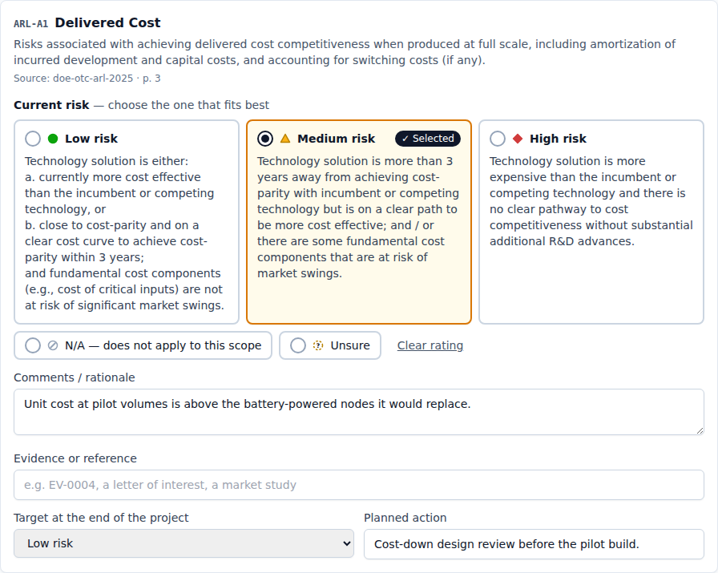
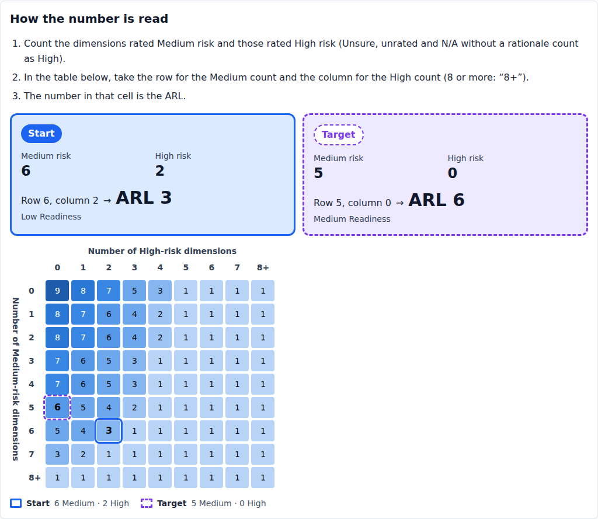
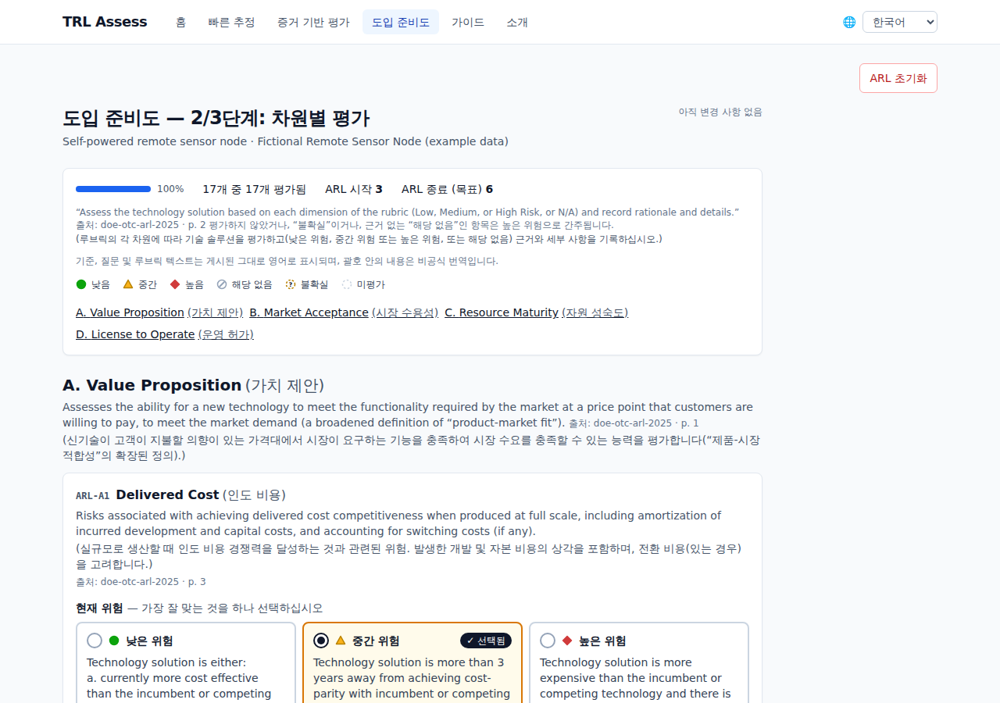

<div align="center">

# TRL Assess

**Self-assess Technology Readiness (TRL) and Adoption Readiness (ARL) against published DoD and DOE
criteria — in your browser, in eight languages.**

[](https://denny-hwang.github.io/TRL-assess/)

**https://denny-hwang.github.io/TRL-assess/**

[](https://github.com/Denny-Hwang/TRL-assess/actions/workflows/ci.yml)
[](https://github.com/Denny-Hwang/TRL-assess/actions/workflows/deploy.yml)


[Guide](https://denny-hwang.github.io/TRL-assess/#/guide/overview) ·
[Sources](docs/sources/SOURCES.md) ·
[Changelog](CHANGELOG.md) ·
[Report an issue](https://github.com/Denny-Hwang/TRL-assess/issues)

</div>

## At a glance

|                   | Technology Readiness Level (TRL)                                                                                                                                                                                         | Adoption Readiness Level (ARL)                                                                                                                                                                                                                                                                  |
| ----------------- | ------------------------------------------------------------------------------------------------------------------------------------------------------------------------------------------------------------------------ | ----------------------------------------------------------------------------------------------------------------------------------------------------------------------------------------------------------------------------------------------------------------------------------------------- |
| **Based on**      | U.S. Department of Defense (DoD)<br>[**Technology Readiness Assessment Guidebook**](https://www.cto.mil/wp-content/uploads/2025/03/TRA-Guide-Feb2025.v2-Cleared.pdf), February 2025                                      | U.S. Department of Energy (DOE)<br>[**Adoption Readiness Assessment**](https://www.energy.gov/sites/default/files/2025-04/ARL%20Assessment%204-25-25_0.pdf), Version: April 2025 · [framework page](https://www.energy.gov/technologycommercialization/adoption-readiness-levels-arl-framework) |
| **Taken from it** | The TRL 1–9 definitions and descriptions for hardware and software (Tables 2-1 and 2-2) and the definitions of relevant and operational environments, word for word. The quick-estimate questions are adapted from them. | The 17 adoption-risk dimensions, their Low / Medium / High rating text and the ARL look-up table, word for word.                                                                                                                                                                                |
| **You get**       | An estimated TRL in about five minutes, then an evidence-backed TRL for each Critical Technology Element (CTE) and for the system.                                                                                       | ARL Start (now) and ARL End (at the end of the project), read from DOE's look-up table.                                                                                                                                                                                                         |

- 🌐 **Eight languages.** English (default), 한국어, 中文, 日本語, Español, Deutsch, हिन्दी and العربية —
  choose one from 🌐 at the top right of the app. Criteria and rubric text stay in the original
  English, with an unofficial translation in parentheses beneath.
- 🔒 **Stays in your browser.** No sign-up, no backend, no tracking. What you enter is stored in this
  browser only and leaves it only in the files you download.

> [!IMPORTANT]
> **For internal self-assessment.** TRL Assess applies published DoD and DOE text to your own
> answers. It does not replace a formal TRA or ARL assessment or an independent review, and it
> cannot verify your evidence.

## What you can do

| Quick Estimate · TRL Tier 1                                                                                                       | Evidence-Based Assessment · TRL Tier 2                                                                                                    | Adoption Readiness · ARL                                                                                                            |
| --------------------------------------------------------------------------------------------------------------------------------- | ----------------------------------------------------------------------------------------------------------------------------------------- | ----------------------------------------------------------------------------------------------------------------------------------- |
|                         |                  |               |
| Nine yes / no questions, about five minutes, no documents. Gives an **estimated TRL**, cross-checked against build × environment. | Break the system into CTEs, mark each criterion Met, Not met or N/A and link the evidence. Gives an **evidence-backed TRL** and the gaps. | Rate 17 adoption-risk dimensions Low, Medium or High, now and at project end. Gives **ARL Start** and **ARL End** from DOE's table. |
| _Estimate — self-reported, no evidence_                                                                                           | _Evidence-backed self-assessment — not an independent Technology Readiness Assessment_                                                    | _Adoption readiness self-assessment — not reviewed or endorsed by DOE_                                                              |

Every module exports an Excel workbook. The evidence-based assessment can also be packaged as a
`.zip` with the evidence files and a SHA-256 manifest, and the whole session saves to and restores
from JSON.

## Quick start

1. Open **https://denny-hwang.github.io/TRL-assess/** and, if you like, pick a language from 🌐.
2. **TRL:** choose **Quick Estimate**, fill in the context and answer the nine questions (`Y` / `N` /
   `U` on the keyboard). Then **Continue to Evidence Assessment** to break the system into CTEs and
   link the evidence.
3. **ARL:** open **Adoption Readiness**, describe the scope and rate each of the 17 dimensions, now
   and for the end of the project.
4. Download the Excel workbook — or the evidence package, to send the files along with it.

Nothing is uploaded, so export or save the session JSON before you clear your browser data.

## How scoring works

**TRL — conservative by design**

- A level counts only if every level below it counts, and "Unsure" never counts as "Yes".
- A criterion is satisfied when it is **Met** with at least one non-rejected evidence item, or
  **N/A** with a justification.
- A level is achieved when every applicable mandatory criterion is satisfied **and** at least one
  criterion there is Met with evidence — N/A alone never carries a level.
- A CTE's TRL is its highest achieved level; the system summary is the lowest TRL among the critical
  CTEs.

**ARL — DOE's look-up method**

- Each of the 17 dimensions is rated Low, Medium or High risk (or N/A), now and at the end of the
  project.
- The number of Medium-risk dimensions picks the row of DOE's look-up table, the number of High-risk
  dimensions picks the column, and that cell is the ARL (1–9).
- Unsure, unrated and N/A without a rationale count as High — this tool's conservative convention,
  not DOE's.

Full detail, with worked examples, in the Guide:
[Methodology](https://denny-hwang.github.io/TRL-assess/#/guide/methodology) ·
[Adoption readiness](https://denny-hwang.github.io/TRL-assess/#/guide/arl).

## How far a result can be trusted

| Part                                                                                                | Basis                                                                                            | Checked                                                                        |
| --------------------------------------------------------------------------------------------------- | ------------------------------------------------------------------------------------------------ | ------------------------------------------------------------------------------ |
| ARL rubric and look-up table                                                                        | DOE OTC _Adoption Readiness Assessment_ (April 2025), transcribed verbatim                       | Word by word against the PDF; the look-up table cell by cell                   |
| TRL definitions (default framework)                                                                 | DoD _TRA Guidebook_ (Feb 2025), Tables 2-1 and 2-2, transcribed verbatim                         | Against the guidebook when transcribed; matches the long-published DoD wording |
| Scoring rules, system summary (minimum of critical CTEs), Tier 1 cross-check and consistency rating | **This tool's own conventions** — no source prescribes them                                      | Every rule has a named unit test; stated in full in Guide › Methodology        |
| Evidence                                                                                            | Whatever the assessor links                                                                      | **Not checked** — the tool cannot tell whether a document supports a claim     |
| Marine tailoring (optional framework)                                                               | This tool's own requirements; the NREL and GOOS documents they cite as a basis were not obtained | **Not checked** against those documents                                        |
| Translations                                                                                        | Unofficial, machine-produced and machine-reviewed                                                | English is authoritative                                                       |

**When you share a result, describe it as** an internal self-assessment that applies published DoD
and DOE text verbatim — not a formal TRA or ARL assessment, and not an independent review.

## Screenshots

| Criteria and evidence                                                                                              | Rating an ARL dimension                                                                                               |
| ------------------------------------------------------------------------------------------------------------------ | --------------------------------------------------------------------------------------------------------------------- |
|          |  |
| **How the ARL is read**                                                                                            | **The interface in Korean**                                                                                           |
|  |    |

## Frameworks and sources

| Framework                  | Scope                                     | Tier 1                                | Tier 2                                                   |
| -------------------------- | ----------------------------------------- | ------------------------------------- | -------------------------------------------------------- |
| `dod-tra-2025` _(default)_ | Generic hardware, software and process    | Adapted from the DoD hardware table   | Verbatim DoD hardware, software and environment criteria |
| `marine-energy-eere`       | Marine energy and ocean-observing devices | Adapted from DOE EERE TRL definitions | DoD criteria + 8 marine/ocean tailoring items            |

The ARL module scores against `doe-otc-arl-2025` — the DOE Adoption Readiness Assessment's 17
dimensions, rating text and look-up table, transcribed verbatim.

<details>
<summary><b>Source documents</b></summary>

| Source id                     | Document                                                              | Held                                             | Quotable                                  |
| ----------------------------- | --------------------------------------------------------------------- | ------------------------------------------------ | ----------------------------------------- |
| `dod-tra-2025`                | DoD _Technology Readiness Assessment Guidebook_, Feb 2025             | Yes                                              | Yes (public domain)                       |
| `doe-otc-arl-2025`            | DOE OTC _Adoption Readiness Assessment_, Version: April 2025          | Yes                                              | Yes (public domain)                       |
| `eere-r540-112-02`            | DOE EERE R 540.112-02, _Technology Readiness Levels (TRLs)_           | Yes                                              | Yes (public domain)                       |
| `dod-mrl-matrix-2018`         | DoD _Manufacturing Readiness Level Matrix_ V2018                      | Yes                                              | Reference only                            |
| `nrel-me-risk`                | NREL _Marine Energy Technology Development Risk Management Framework_ | No                                               | Basis of tailoring rationales only        |
| `nrel-tpl`, `goos-foo`        | NREL TPL; GOOS Framework for Ocean Observing                          | No                                               | Reference only                            |
| `iso-16290`                   | ISO 16290:2013                                                        | No                                               | **Clause references only — never quoted** |
| `doe-g413-3-4a`, `gao-20-48g` | DOE G 413.3-4A; GAO-20-48G                                            | **No — not obtainable in the build environment** | No content is attributed to them          |

Details, URLs and the SHA-256 hashes of the held documents are in
[docs/sources/SOURCES.md](docs/sources/SOURCES.md).

</details>

**Provenance policy.** Every question and criterion carries an `origin`:

- `verbatim` — copied exactly; permitted only from public-domain, quotable U.S. Government documents,
  and only with a section or page reference.
- `adapted` — source wording restructured (for example, a definition turned into a question); a
  rationale is required.
- `tailored` — not in any source; a rationale is required.

`npm run validate:criteria` enforces all of this, including the rule that ISO text is never quoted.

## Privacy and security

- **Client-side only.** No backend, no accounts, no analytics, no telemetry. The end-to-end tests
  fail the build if the app makes any cross-origin request.
- **Where your data lives:** the assessment in `localStorage` (`trl-assess:session:v1`), evidence
  file contents in IndexedDB (`trl-assess-evidence`). Nothing is synced between devices.
- **Clearing it:** "Clear all local data" on the About page removes both; clearing site data in the
  browser does the same.
- **Controlled information:** do not enter classified, export-controlled or CUI material. Evidence
  marked **"Sensitive — reference only"** refuses to accept a file, so you can record a pointer —
  title, custodian, reference number — without placing the content in a tool on a public site. Those
  items are never bundled into an evidence package.
- A restrictive Content-Security-Policy meta tag limits the page to same-origin resources.

See [SECURITY.md](SECURITY.md).

## Exports

| Export                             | File                               | Contents                                                                       |
| ---------------------------------- | ---------------------------------- | ------------------------------------------------------------------------------ |
| Quick Estimate workbook            | `TRL_Tier1_<project>_<time>.xlsx`  | 6 sheets                                                                       |
| Evidence-Based Assessment workbook | `TRL_Tier2_<project>_<time>.xlsx`  | 9 sheets                                                                       |
| ARL workbook                       | `ARL_<project>_<time>.xlsx`        | 7 sheets                                                                       |
| Evidence package                   | `TRL_Tier2_<project>_<time>.zip`   | The Tier 2 workbook, `session.json`, the evidence files and a SHA-256 manifest |
| Session                            | Same name as the workbook, `.json` | The whole assessment; imports back without loss                                |

`<time>` is `YYYYMMDD-HHmm`.

Workbooks follow the interface language; sheet names, dropdown values and source text stay in
English. They carry data validation, conditional formatting and working `HYPERLINK()` formulas, and
their values are static — edit in the app and export again.

<details>
<summary><b>Workbook sheets</b></summary>

**Tier 1 workbook**

| Sheet                        | Contents                                                                                  |
| ---------------------------- | ----------------------------------------------------------------------------------------- |
| `README`                     | Label, disclaimer, sheet guide, placeholder instructions, tool/framework/build provenance |
| `Summary`                    | Estimated TRL, highest level claimed, cross-check, consistency rating, flags              |
| `Context`                    | Every context field, with environment and build codes explained                           |
| `Responses`                  | One row per question: answer (validated), note, origin, source                            |
| `Next_Evidence_Placeholders` | Criteria for the next two levels + 10 blank planning rows                                 |
| `References`                 | Source documents with clickable URLs                                                      |

**Tier 2 workbook**

| Sheet                 | Contents                                                                                                        |
| --------------------- | --------------------------------------------------------------------------------------------------------------- |
| `README`              | As above, plus how to attach evidence in Excel                                                                  |
| `Summary`             | System summary, limiting CTE(s), Tier 1 delta, per-CTE table                                                    |
| `CTE_Register`        | Every CTE with kind, critical flag, owner, target and assessed TRL                                              |
| `Criteria_Assessment` | One row per CTE × criterion: status, justification, computed Satisfied, evidence ids, placeholder column, notes |
| `Evidence_Register`   | Every evidence item + **50** pre-formatted blank placeholder rows (`EV-P001`…)                                  |
| `Gap_Actions`         | Unmet mandatory criteria at each CTE's next level + 20 blank rows                                               |
| `Review_Signoff`      | Assessor and independent-reviewer blocks with a validated conclusion list                                       |
| `References`          | Every source cited by the framework                                                                             |
| `Metadata`            | Schema, app and framework versions, git SHA, timestamps, package type, counts                                   |

**ARL workbook**

| Sheet             | Contents                                                                                                                      |
| ----------------- | ----------------------------------------------------------------------------------------------------------------------------- |
| `README`          | ARL label and disclaimer, how the ARL is calculated, provenance                                                               |
| `Summary`         | ARL Start, ARL End (target), tallies per core risk area, flags                                                                |
| `Scope`           | Technology scope, value chain scope, timeline, policy environment                                                             |
| `Risk_Assessment` | One row per dimension: current rating (validated), what it counted as and why, rationale, target, planned action, rubric text |
| `ARL_Lookup`      | The source look-up table with the Start and Target cells marked                                                               |
| `References`      | The rubric                                                                                                                    |
| `Metadata`        | Schema, app and rubric versions, the session's TRL framework, git SHA, timestamps                                             |

**Placeholder rows.** Blank rows already carry the validation lists and the `Open` formula
`=IF(G{r}<>"",HYPERLINK(G{r},"Open file"),IF(F{r}<>"",HYPERLINK(F{r},"Open link"),""))`. Fill in a URL
or a relative path and the link becomes clickable.

</details>

<details>
<summary><b>Evidence package: layout and verification</b></summary>

```
TRL_Tier2_<project>_<YYYYMMDD-HHmm>/
├── TRL_Tier2_<project>_<YYYYMMDD-HHmm>.xlsx   # "Local file" cells link into evidence/
├── session.json                                # the full assessment, re-importable
├── evidence/
│   ├── EV-0001_test-report.pdf
│   └── …
├── MANIFEST.sha256.txt                         # every packaged file except the manifest
└── README.txt                                  # how to verify and open
```

Verify the contents after unzipping:

```bash
# Linux / macOS
cd TRL_Tier2_<project>_<timestamp>
sha256sum -c MANIFEST.sha256.txt
```

```powershell
# Windows PowerShell
Get-Content MANIFEST.sha256.txt | ForEach-Object {
  $parts = $_ -split "\s+", 2
  $hash = (Get-FileHash -Algorithm SHA256 $parts[1].Trim()).Hash.ToLower()
  if ($hash -eq $parts[0]) { "OK   $($parts[1])" } else { "FAIL $($parts[1])" }
}
```

Unzip the whole folder before opening the workbook, and keep the workbook next to `evidence/` —
that is what makes the relative links work. Files over 50 MB are rejected, and a package over
250 MB is refused with a list of the largest files.

</details>

## For developers

Requires **Node.js ≥ 20** and npm.

```bash
git clone https://github.com/Denny-Hwang/TRL-assess.git
cd TRL-assess
npm ci
npm run dev       # dev server on http://localhost:5173/TRL-assess/
npm run verify    # lint, typecheck, tests, criteria validation, link check, build: the CI gate
```

<details>
<summary><b>All commands</b></summary>

```bash
npm run dev                 # dev server on http://localhost:5173/TRL-assess/
npm run test                # unit + component tests with coverage thresholds
npm run test:e2e            # Playwright end-to-end tests (build first)
npm run validate:criteria   # framework schema + provenance checks
npm run check:links         # documentation link check
npm run verify              # everything the CI gate runs
npm run build && npm run preview
npm run screenshots         # regenerate docs/img/*.png (build first)
```

`npm run test:e2e` needs a build (`npm run build`) and a Chromium. On a machine where Playwright's
own download is unavailable, point it at an existing browser with
`PLAYWRIGHT_CHROMIUM_PATH=/path/to/chrome npm run test:e2e`.

</details>

<details>
<summary><b>Project structure</b></summary>

```
src/
├── config/app.config.ts        # every tunable value — the single source of truth
├── data/
│   ├── frameworks/<id>/        # framework.json, tier1.json, tier2.json, tier1-matrix.json
│   ├── frameworks/arl/         # ARL rubric (doe-otc-arl-2025.json)
│   ├── examples/               # the fictional example session
│   └── sources.ts              # machine-readable mirror of docs/sources/SOURCES.md
├── i18n/                       # interface text: en/ (English) + one catalog per language
├── domain/                     # pure TypeScript: schemas, scoring, session, hashing (no React)
├── export/                     # excel/ (shared, tier1, tier2, arl), zip/ (package), download helpers
├── storage/                    # localStorage session store, IndexedDB blob store
├── state/                      # zustand store with autosave
├── features/                   # home, tier1, tier2, arl, guide, about
├── components/                 # shared UI
└── content/guide/              # the in-app Guide (English *.md, translations in <lang>/)
scripts/                        # validate-criteria.ts, check-docs-links.ts
tests/{unit,component,e2e}/     # Vitest unit/component tests, Playwright end-to-end tests
docs/                           # SOURCES, screenshots
```

</details>

<details>
<summary><b>Configuration</b></summary>

Everything tunable lives in `src/config/app.config.ts`:

| Key                               | Default                      | Effect                                                        |
| --------------------------------- | ---------------------------- | ------------------------------------------------------------- |
| `APP_NAME`                        | `TRL Assess`                 | Title, footer, export metadata                                |
| `GITHUB_OWNER` / `REPO_NAME`      | `Denny-Hwang` / `TRL-assess` | Source and issue links, Pages URL                             |
| `PAGES_BASE_PATH`                 | `/TRL-assess/`               | Vite `base`; must equal `/<REPO_NAME>/`                       |
| `DEFAULT_FRAMEWORK`               | `dod-tra-2025`               | Framework selected for a new session                          |
| `MAX_EVIDENCE_FILE_MB`            | `50`                         | Largest single evidence file accepted                         |
| `MAX_PACKAGE_TOTAL_MB`            | `250`                        | Pre-flight limit for the evidence package                     |
| `BLANK_EVIDENCE_PLACEHOLDER_ROWS` | `50`                         | Blank rows appended to `Evidence_Register`                    |
| `BLANK_GAP_ACTION_ROWS`           | `20`                         | Blank rows appended to `Gap_Actions`                          |
| `SCHEMA_VERSION`                  | `2`                          | Session schema; bump with a migration hook (v2 adds `arl`)    |
| `DEFAULT_ARL_FRAMEWORK`           | `doe-otc-arl-2025`           | ARL rubric used for a new ARL assessment                      |
| `AUTOSAVE_DEBOUNCE_MS`            | `600`                        | Debounce for text edits (structural changes save immediately) |
| `TIER1_LABEL` / `TIER2_LABEL`     | —                            | Honest-labelling strings used in the UI and every export      |
| `ARL_LABEL` / `ARL_TARGET_LABEL`  | —                            | The ARL module's own labels, on its result page and workbook  |

`VITE_BASE_PATH` overrides the base path at build time; `VITE_GIT_SHA` overrides the build SHA.

</details>

<details>
<summary><b>Editing or adding criteria</b></summary>

Frameworks are data, not code.

1. Edit `src/data/frameworks/<id>/tier1.json` or `tier2.json` — or add a new folder and register it
   in `src/data/frameworks/index.ts`.
2. Give every item a `source` (`sourceId`, `section`, `page`) and an `origin`. `tailored` and
   `adapted` items need a `rationale`.
3. An extending framework may reference a base criterion with `{ id, refId, mandatory?, … }` instead
   of repeating its text; text, source and origin always come from the base, so provenance cannot be
   rewritten downstream.
4. Run `npm run validate:criteria`, bump the framework `version`, and add a CHANGELOG entry.

To report a problem with a criterion rather than fix it, open a **Criteria correction** issue. See
[CONTRIBUTING.md](CONTRIBUTING.md).

</details>

<details>
<summary><b>Testing and quality gates</b></summary>

`npm run verify` runs lint → typecheck → tests → criteria validation → link check → build, and is
what CI enforces on every pull request.

- **Coverage:** `src/domain` must stay at ≥ 95 % lines, functions and statements and ≥ 85 %
  branches. Every scoring rule has a named test.
- **Bundle budget:** the entry chunk must stay under 300 kB gzip and must not contain ExcelJS or
  JSZip.
- **Accessibility:** axe checks run against every route in Playwright; zero serious or critical
  issues are allowed.
- **Network guard:** the end-to-end tests fail if the app issues any cross-origin request.
- Tests are never skipped or weakened to make CI pass.

</details>

<details>
<summary><b>Deployment</b></summary>

GitHub Pages, via `.github/workflows/deploy.yml`, on every push to `main` and on demand
(`workflow_dispatch`). The workflow builds with `VITE_GIT_SHA` set to the commit, uploads the Pages
artifact and deploys it with the official Pages actions.

**First-time setup, required once:** repository **Settings → Pages → Build and deployment →
Source: GitHub Actions**, then re-run the "Deploy to GitHub Pages" workflow. Until Pages is enabled
the deploy job fails at `actions/configure-pages` with "Get Pages site failed … Not Found"; the
workflow's own token is not permitted to create the site. The base path must match the repository
name — if you fork under another name, change `REPO_NAME` in `src/config/app.config.ts` (and the
default in `vite.config.ts`).

</details>

Versions follow [Semantic Versioning](https://semver.org/spec/v2.0.0.html); the history is in
[CHANGELOG.md](CHANGELOG.md). The running version and git SHA are shown in the app footer and
written into every export, so any workbook can be traced back to the build that produced it.
Contributions: see [CONTRIBUTING.md](CONTRIBUTING.md).

## Limitations

TRL Assess produces a **self-assessment only**. It is not an independent Technology Readiness
Assessment, not an audit, and not a certification. Results depend entirely on the information the
user enters; nothing is verified by the tool. Assessment criteria differ between agencies and
programmes — check the criteria and their sources before using a result in any formal submission.

- The build × environment matrix in Tier 1 is a **heuristic aid created for this tool**, not a
  standard, and never overrides your answers.
- The system summary is the **minimum across critical CTEs** — a conservative reporting convention,
  not a mandated formula.
- The generic `dod-tra-2025` framework marks **no criterion mandatory**, because its source does not
  classify them; every level in that framework is flagged for assessor confirmation.
- DOE G 413.3-4A and GAO-20-48G were not obtainable in the build environment, so neither is
  implemented and no content is attributed to them.
- The TRL 9 question in the marine framework comes from the DoD guidebook, because the EERE source
  defines TRL 1–8 only.
- Exported workbooks are static snapshots and cannot be re-imported; session JSON can.
- The ARL module applies DOE's rubric to **your** ratings; DOE does not review or endorse the result.
  Counting Unsure, Not assessed and N/A-without-rationale as High risk is this tool's conservative
  convention, not a rule of the source.

## Citation

See [CITATION.cff](CITATION.cff), or cite as: _TRL Assess (version 1.0.0).
https://github.com/Denny-Hwang/TRL-assess_

## License

[MIT](LICENSE). The transcribed criteria come from U.S. Government public-domain documents; ISO
material is cited by clause only and never reproduced.

## Acknowledgments

Criteria are transcribed from work published by the U.S. Department of Defense (OUSD(R&E)) and the
U.S. Department of Energy (Office of Energy Efficiency and Renewable Energy; Office of Technology
Commercialization). The optional marine tailoring is informed by NREL's marine-energy risk framework
and by the GOOS Framework for Ocean Observing.

## Contact

Issues and questions: https://github.com/Denny-Hwang/TRL-assess/issues
